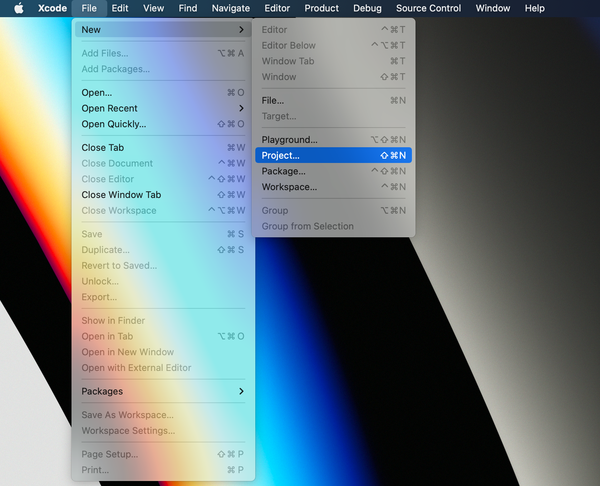
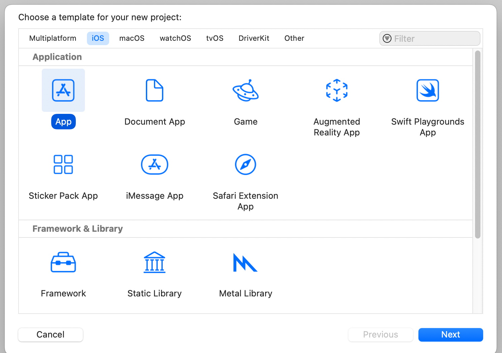
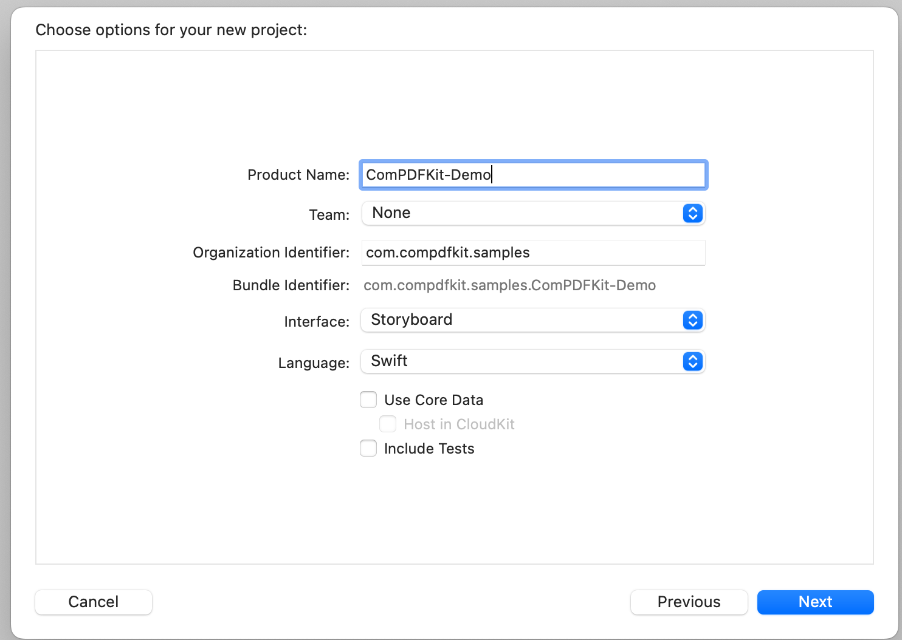
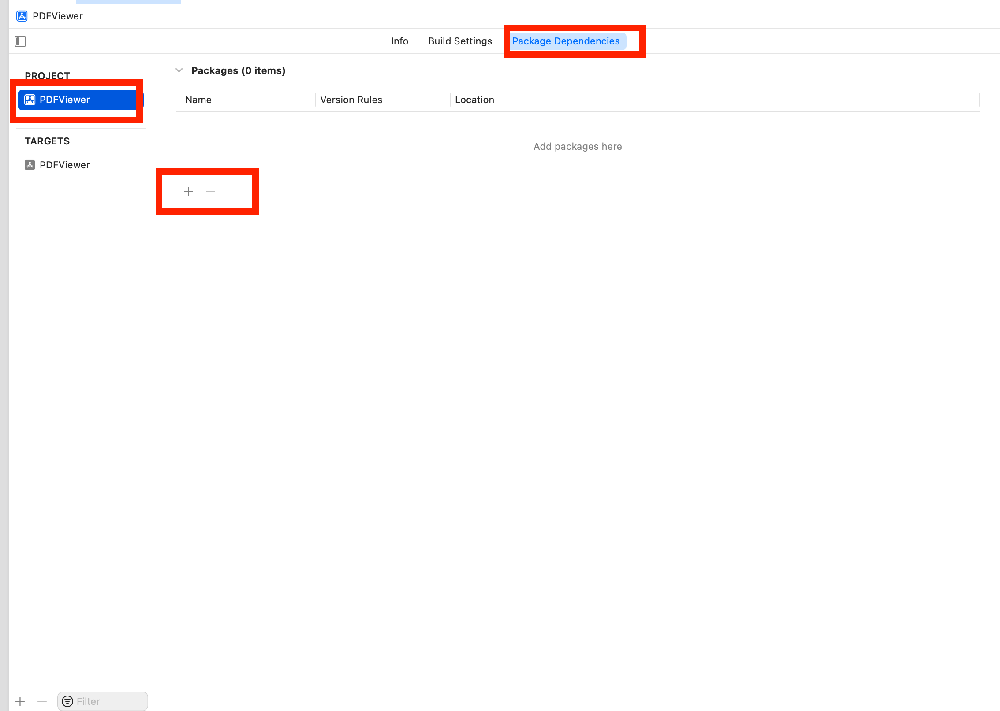
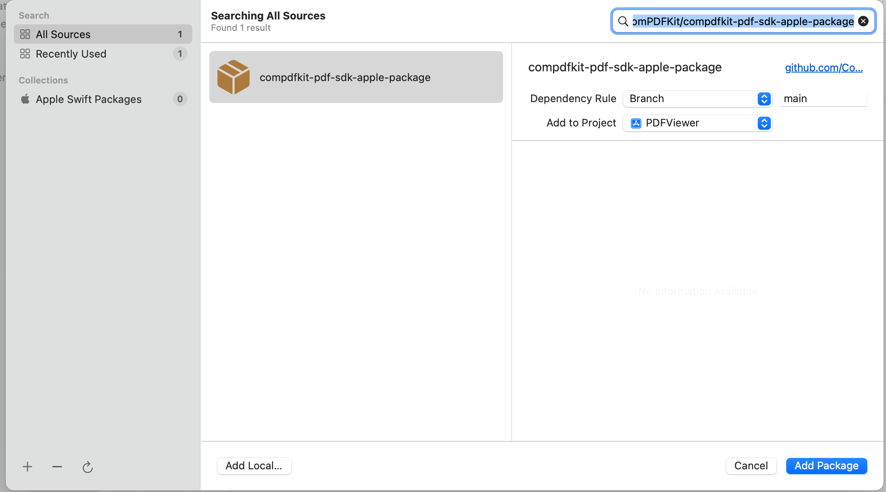
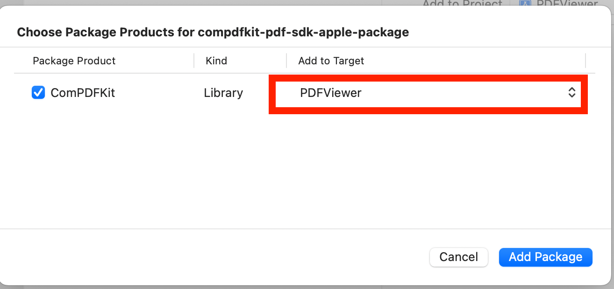
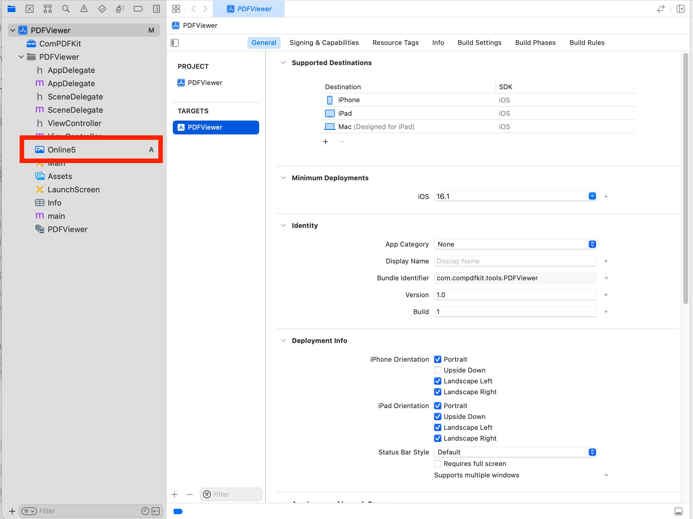
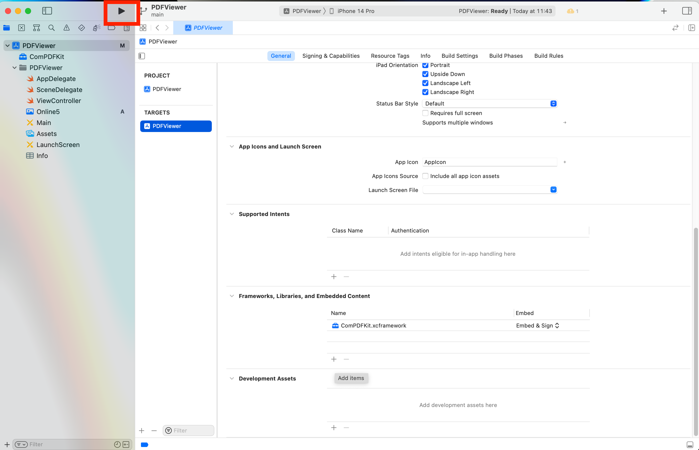
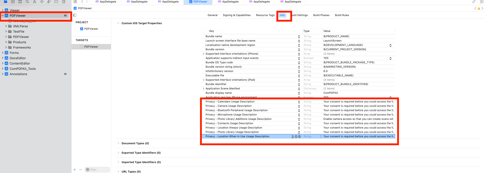

# ComPDFKit

[ComPDFKit PDF SDK](https://www.compdf.com/) seamlessly operates on [Web](https://www.compdf.com/web), [Windows](https://www.compdf.com/windows), [Android](https://www.compdf.com/android), [iOS](https://www.compdf.com/ios), [Mac](https://www.compdf.com/contact-sales), and [Server](https://www.compdf.com/server), with support for cross-platform frameworks such as [React Native](https://www.compdf.com/react-native), [Flutter](https://www.compdf.com/flutter), etc.


# Introduction

[ComPDFKit PDF SDK - Apple Package](https://www.compdf.com/ios) is a configuration file tailored for seamless integration of our Swift-based PDF Library into iOS applications. [ComPDFKit PDF SDK - Swift](https://github.com/ComPDFKit/compdfkit-pdf-sdk-ios-swift) provides a slick out-of-the-box responsive UI that interacts with the core library to view, annotate, and manipulate PDFs. It is feature-rich and battle-tested, making PDF files process much easier and faster for iOS and macOS devices.


# Related

- [ComPDFKit PDF Library for iOS (Objective-C)](https://github.com/ComPDFKit/compdfkit-pdf-sdk-ios-objective-c)
- [ComPDFKit PDF Library for Android](https://github.com/ComPDFKit/compdfkit-pdf-sdk-android)
- ComPDFKit PDF SDK - [Flutter Library](https://pub.dev/packages/compdfkit_flutter)
- ComPDFKit PDF SDK - [React Native Library](https://github.com/ComPDFKit/compdfkit-pdf-sdk-react-native)
- [How to Build an iOS PDF Viewer or Editor in Swift](https://www.compdf.com/blog/build-an-ios-pdf-viewer-or-editor-in-swift)
- [How to Build an iOS PDF Viewer or Editor in Objective-C](https://www.compdf.com/blog/build-an-ios-pdf-viewer-or-editor-in-objective-c)


# Getting Started

It's easy to embed ComPDFKit into an iOS application with a few lines of Swift or Objective-C code. Take a few minutes to get started.

The following sections explain how to run integration with Swift Package into your project


## Requirements

[ComPDFKit PDF SDK - Swift Package](https://www.compdf.com/guides/pdf-sdk/ios/overview) requires the latest stable version of Xcode available at the time the release was made. This is a hard requirement, as each version of Xcode is bundled with a specific version of the iOS Base SDK, which often defines how UIKit and various other frameworks behave. 

- The iOS 10.0 or higher.
- The [Xcode](https://developer.apple.com/xcode/) 13.0 or newer for Objective-C or Swift.


## Apply the License Key

ComPDFKit Apple Package supports flexible licensing options, including online and offline licenses. You can apply for a [free trial license](https://www.compdf.com/pricing) on our website or contact [our sales team](mailto:support@compdf.com) to get the offline license. Each license is only valid for a root domain name and any of its subdomains. However, any documents, sample code, or source code distribution from the released package of ComPDFKit PDF SDK to any third party is prohibited.

To learn how to [copy and apply the license key](https://www.compdf.com/guides/pdf-sdk/ios/apply-the-license-key) and more details about our license, please visit our comprehensive documentation.


# How to Make an iOS PDF Editor with Swift Package Manager


## Creating a New Xcode Project

1. Open Xcode and select **File** > **New** > **Project…** to create a new project for your application:

   

2. Choose the **App** template for your project:

   

3. When prompted, enter your app name (ComPDFKit-Demo) and your organization identifier (com.example) and choose **Storyboard** for the interface:

   

4. Click **Next** and select the location to save the project.

5. Click **Create** to finish.

   

## Integrate ComPDFKit Apple Package into SPM

1. Open your application in Xcode and select your project’s **Package Dependencies** tab.

   

2. Copy the [ComPDFKit Apple package](https://github.com/ComPDFKit/compdfkit-pdf-sdk-apple-package) repository URL into the search field:

   ```shell
   https://github.com/ComPDFKit/compdfkit-pdf-sdk-apple-package
   ```

   

3. In the **Dependency Rule** fields, select **Branch** > **master**, and then click **Add Package**.



4. After the package download completes, select **Add Package**.


5. ComPDFKit should now be listed under Swift Package Dependencies in the Xcode Project navigator.


## Display a PDF Document

So far, we have added ***"ComPDFKit.xcframework"*** to the ***"PDFViewer"*** project, and finished the initialization of the ComPDFKit PDF SDK. Now, let’s start building a simple PDF viewer with just a few lines of code.

1. Prepare a test PDF file, drag and drop it into the newly created **PDFView** project. By this way, you can load and preview the local PDF document using `NSBundle`. The following image shows an example of importing a PDF document named `Online5` into the project.

   

   

2. Create a `CPDFDocument` object through **NSURL**, and create a `CPDFView` to display it. The following code shows how to load PDF data using a local PDF path and display it by `CPDFView`.

   ```swift
   guard let filePath = Bundle.main.path(forResource: "Online5", ofType: "pdf") else { return  }
   let url = URL(fileURLWithPath: filePath)
   let document = CPDFDocument(url: url)
   
   let rect = self.view.bounds
   let pdfView = CPDFView(frame: self.view.bounds)
   pdfView.autoresizingMask = [.flexibleWidth, .flexibleHeight]
   pdfView.document = document
   ```

3. Add the created `CPDFView` to the view of the current controller. The sample code shows below.

   ```swift
   self.view.addSubview(pdfView)
   ```

   The code shown here is a collection of the steps mentioned above:

   ```swift
   override func viewWillAppear(_ animated: Bool) {
        super.viewWillAppear(animated)
           
        guard let filePath = Bundle.main.path(forResource: "Online5", ofType: "pdf") else { return  }
        let url = URL(fileURLWithPath: filePath)
        let document = CPDFDocument(url: url)
   
        let rect = self.view.bounds
        let pdfView = CPDFView(frame: self.view.bounds)
        pdfView.autoresizingMask = [.flexibleWidth, .flexibleHeight]
        pdfView.document = document
        self.view.addSubview(pdfView)
   }
   ```

4. Connect your device or simulator, and use shortcut **Command_R** to run the App. The PDF file will be opened and displayed.

   


## Add Required Permissions

To protect user privacy, before accessing the sensitive privacy data, you need to find the "***Info***" configuration in your iOS 10.0 or higher iOS project and configure the relevant privacy terms as shown in the following picture.



```objective-c
<key>NSCameraUsageDescription</key>
<string>Your consent is required before you could access the function.</string>

<key>NSMicrophoneUsageDescription</key>
<string>Your consent is required before you could access the function.</string>

<key>NSPhotoLibraryAddUsageDescription</key>
<string>Your consent is required before you could access the function.</string>

<key>NSPhotoLibraryUsageDescription</key>
<string>Your consent is required before you could access the function.</string>
```


# Support

ComPDFKit has a professional R&D team that produces comprehensive technical documentation and guides to help developers. Also, you can get an immediate response when reporting your problems to our support team.

- For detailed information, please visit our [Guides](https://www.compdf.com/guides/pdf-sdk/ios/overview) page.
- Stay updated with the latest improvements through our [Changelog](https://www.compdf.com/pdf-sdk/changelog-ios).
- For technical assistance, please reach out to our [Technical Support](https://www.compdf.com/support).
- To get more details and an accurate quote, please contact our [Sales Team](https://compdf.com/contact-us).


Thanks,
The ComPDFKit Team